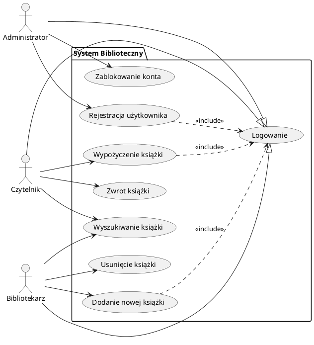
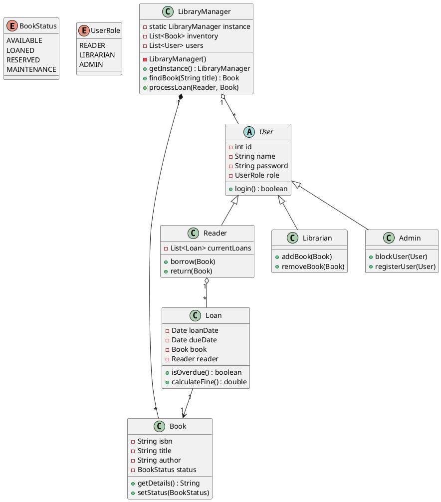
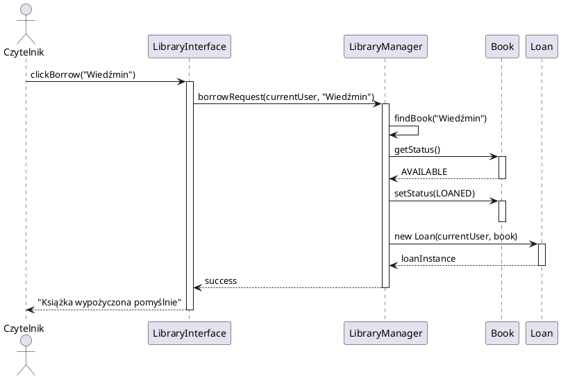
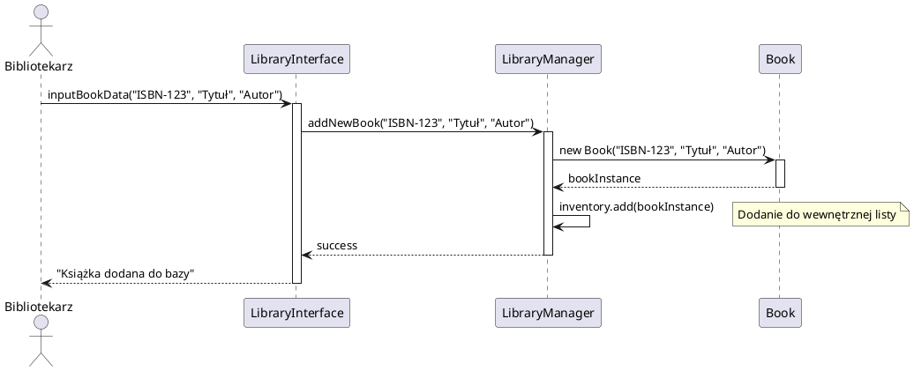
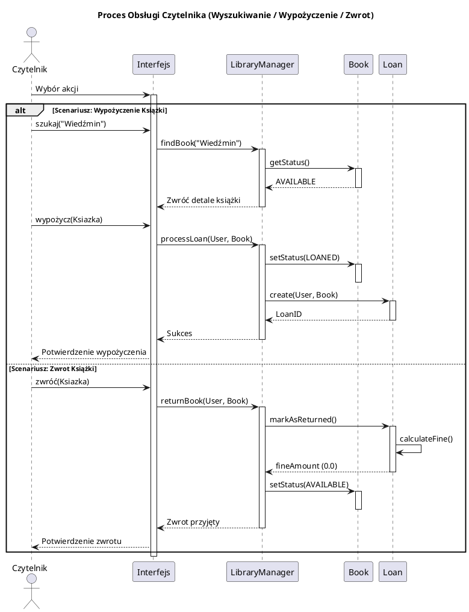
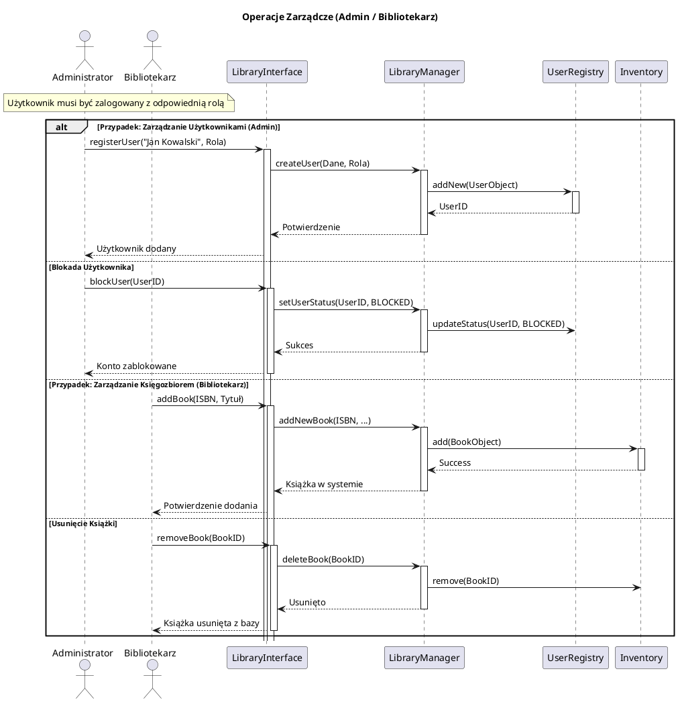

# System Zarządzania Biblioteką (Library Management System)

## Opis Projektu
Projekt to prosty system informatyczny służący do obsługi procesów bibliotecznych, zaprojektowany w paradygmacie obiektowym. Aplikacja umożliwia zarządzanie księgozbiorem, obsługę wypożyczeń oraz administrację użytkownikami. Projekt kładzie nacisk na poprawną strukturę klas, separację uprawnień oraz wykorzystanie podstawowych wzorców projektowych.

## Aktorzy Systemu

1.  **Czytelnik (Reader):**
    * Przeglądanie katalogu książek.
    * Wypożyczanie dostępnych pozycji.
    * Zwrot książek.
    * Podgląd historii wypożyczeń.
2.  **Bibliotekarz (Librarian):**
    * Zarządzanie księgozbiorem (dodawanie/usuwanie książek).
    * Weryfikacja stanu książek.
3.  **Administrator (Admin):**
    * Zarządzanie użytkownikami (dodawanie pracowników, czytelników).
    * Blokowanie kont użytkowników.

---

## 1. Diagram Przypadków Użycia (Use Case Diagram)

Diagram obrazuje interakcje aktorów z funkcjami systemu. Wszyscy użytkownicy muszą się zalogować, aby uzyskać dostęp do swoich funkcji.

## 2. Diagram Klas
Model domenowy systemu. Zastosowano klasę abstrakcyjną User dla wspólnych cech użytkowników oraz LibraryManager (Singleton) jako główny punkt dostępu do logiki biznesowej.

## 3. Diagramy Sekwencji (Sequence Diagrams)

### Scenariusz 1: Wypożyczenie książki (Ścieżka pozytywna)

Sekwencja przedstawia proces wypożyczenia książki przez zalogowanego czytelnika.

### Scenariusz 2: Dodanie nowej książki (Bibliotekarz)

Sekwencja przedstawia proces dodawania nowej pozycji do inwentarza przez pracownika.

Opisuje kolejnye sekwencje dla wszystkich przypadków użycia. Może to prowadzić do zapełnienia pliku readme (staje się mało czytelny). Można zastosować nieco inne podejście:

## 1. Diagram Sekwencji: Cykl życia wypożyczenia (Czytelnik)

Ten diagram łączy: Wyszukiwanie, Wypożyczenie i Zwrot w jeden logiczny ciąg z użyciem bloku alt

## 2. Diagram Sekwencji: Operacje Administracyjne i Zarządcze

Ten diagram optymalizuje procesy Bibliotekarza (zarządzanie zasobami) i Administratora (zarządzanie ludźmi) na jednym widoku, pokazując, że LibraryManager jest centralnym punktem sterowania.

