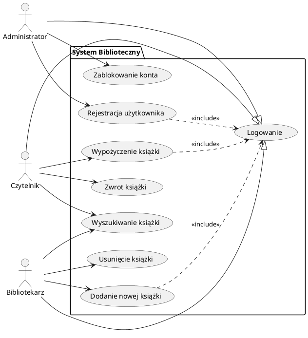

# System Zarządzania Biblioteką (Library Management System)

## Opis Projektu
Projekt to prosty system informatyczny służący do obsługi procesów bibliotecznych, zaprojektowany w paradygmacie obiektowym. Aplikacja umożliwia zarządzanie księgozbiorem, obsługę wypożyczeń oraz administrację użytkownikami. Projekt kładzie nacisk na poprawną strukturę klas, separację uprawnień oraz wykorzystanie podstawowych wzorców projektowych.

## Aktorzy Systemu

1.  **Czytelnik (Reader):**
    * Przeglądanie katalogu książek.
    * Wypożyczanie dostępnych pozycji.
    * Zwrot książek.
    * Podgląd historii wypożyczeń.
2.  **Bibliotekarz (Librarian):**
    * Zarządzanie księgozbiorem (dodawanie/usuwanie książek).
    * Weryfikacja stanu książek.
3.  **Administrator (Admin):**
    * Zarządzanie użytkownikami (dodawanie pracowników, czytelników).
    * Blokowanie kont użytkowników.

---

## 1. Diagram Przypadków Użycia (Use Case Diagram)

Diagram obrazuje interakcje aktorów z funkcjami systemu. Wszyscy użytkownicy muszą się zalogować, aby uzyskać dostęp do swoich funkcji.

