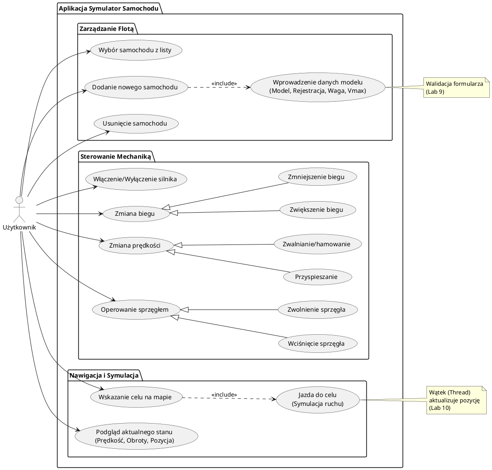
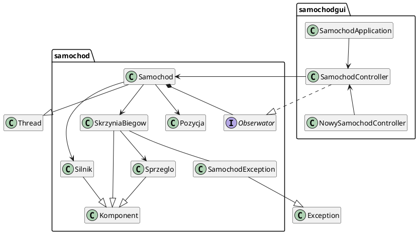
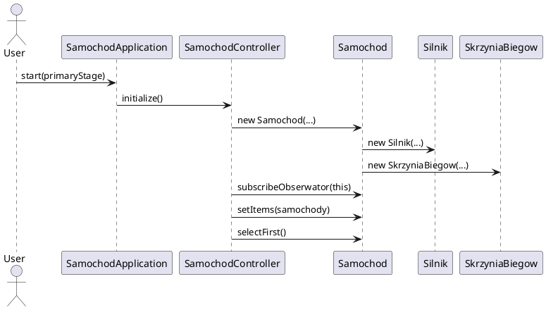
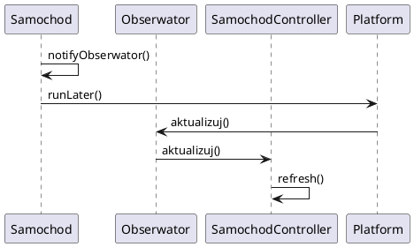
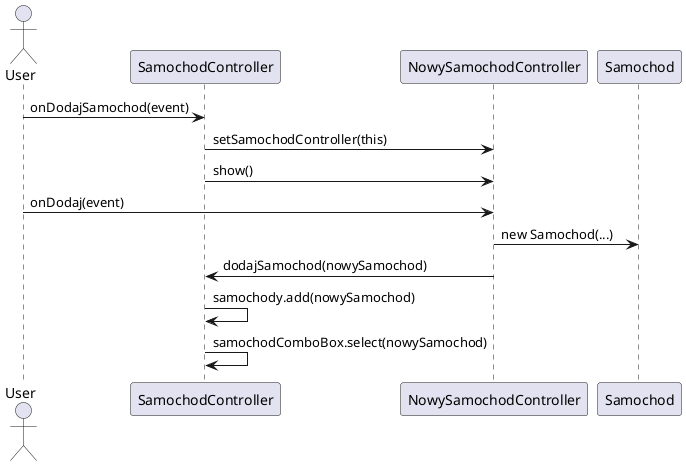

# po2025
Repozytorium dla przedmiotu Programowanie Obiektowe.

Proszę wpisywać się do pliku Projekty.txt przy temacie projektów lub wpisać propozycję swojego tematu. W przypadku edycji pliku Projekty.txt konieczne jest utworzenie Pull Requestu (PR) - Create Pull Request. Wówczas zmiany pokażą się w repo po ich zatwierdzeniu przeze mnie.

### Termin deklaracji projektu - 15.12.2025
### Termin oddania (push do repo) projektu - 27.01.2026
### Termin oddania (push do repo) projektu laboratoryjnego -  27.01.2026

Diagramy UML można rysować w dowolnym programie. W poniższym przykładzie wykorzystany jest język PlantUML i włączony Plugin Mozille (w przeglądarce) Markdown Diagrams.


Projekt laboratoryjny Samochod (symulacja) - GUI
===============================================

Diagramy UML
------------

### Diagram przypadków użycia



### Diagram klas



### Diagram sekwencji



### Diagram sekwencji aktualizacji



### Diagram sekwencji dodania samochodu



### Diagram sekwencji usuwania samochodu

```plantuml
@startuml
actor User
participant SamochodController

User -> SamochodController: onUsunSamochod(event)
SamochodController -> SamochodController: samochody.remove(samochod)
SamochodController -> SamochodController: samochodComboBox.selectFirst()
@enduml
